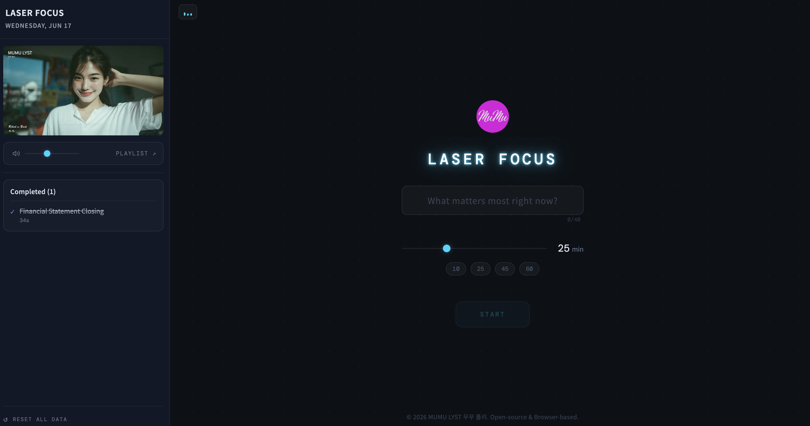
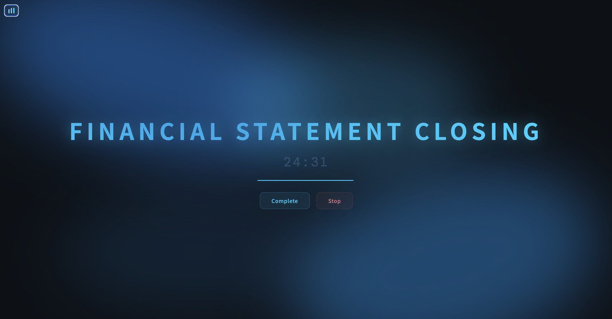

# LASER FOCUS

A minimal focus timer with a built-in YouTube playlist sidebar. No build step, no backend, no account required — just open the file and start working.

 

## Features

- Pomodoro-style timer with custom duration
- YouTube playlist sidebar (plays while you focus)
- Task history with completion tracking
- 3 languages: Korean / English / Japanese
- Animated mesh background that shifts color as the session progresses
- Browser notifications + beep on timer end
- Zero dependencies — pure HTML/CSS/JS, Tailwind via CDN

---

## Fork it in 4 steps

### 1. Fork the repo

Click **Fork** on GitHub, then clone your fork.

### 2. Edit the CONFIG block

Open `script.js` and find the `CONFIG` object at the top (lines 5–28). This is the only block you need to touch:

```js
const CONFIG = {
  title:          'LASER FOCUS',       // App name shown in sidebar and notifications
  startBtnLabel:  'START',             // Start button label

  storageKey:     'laserfocus_tasks',  // Change this to avoid localStorage collisions

  defaultLang:    'ko',                // 'ko' | 'en' | 'ja'
  defaultMinutes: 25,
  maxTaskChars:   20,
  defaultVolume:  60,

  gistUrl: 'YOUR_GIST_URL',           // See "Set up your playlist Gist" below
  playlists: [                         // Fallback if Gist fails or gistUrl is empty
    { id: 'PLAYLIST_ID', title: 'Playlist Name' },
  ],
};
```

**CONFIG reference:**

| Key | What it does |
|-----|-------------|
| `title` | App name shown in the sidebar header, browser tab, and desktop notifications |
| `startBtnLabel` | Text on the start button |
| `storageKey` | localStorage prefix — change this if you run multiple forks on the same domain |
| `defaultLang` | UI language on first load (`ko`, `en`, or `ja`) |
| `defaultMinutes` | Default timer duration in minutes |
| `maxTaskChars` | Character limit for task names |
| `defaultVolume` | Initial YouTube volume (0–100) |
| `gistUrl` | URL of your `playlists.json` Gist (see below). Leave empty to use the `playlists` array only |
| `playlists` | Hardcoded fallback playlist list used when the Gist is unavailable |

### 3. Set up your playlist Gist

1. Go to [gist.github.com](https://gist.github.com)
2. Create a **public** Gist named `playlists.json`
3. Paste your playlists using the format from [`docs/playlists.example.json`](docs/playlists.example.json):
   ```json
   [
     {
       "id": "YOUTUBE_PLAYLIST_ID",
       "title": "Ambient",
       "desc": "Calm background music for deep focus"
     }
   ]
   ```

   **Fields:**

   | Field | Required | Description |
   |-------|----------|-------------|
   | `id` | Yes | YouTube playlist ID (from URL `?list=...`) |
   | `title` | Yes | Display name shown in the playlist modal |
   | `desc` | No | Tooltip shown on hover. Plain string, or `{ "ko": "...", "en": "...", "ja": "..." }` for multilingual |
4. Click **Create public Gist**, then copy the **Raw** URL
5. Paste the raw URL into `CONFIG.gistUrl` in `script.js`

> **Tip:** You can update your playlists anytime by editing the Gist — no redeployment needed.

### 4. Deploy

Push to your fork. Enable **GitHub Pages** (Settings → Pages → Deploy from branch `main`, folder `/root`). Done — your URL will be `https://YOUR_USERNAME.github.io/MumuLaserFocus`.

Works equally well on Netlify, Vercel, or any static host.

---

## Local development

No setup needed:

```bash
open index.html   # macOS
# or just double-click index.html in your file manager
```

---

## Tech stack

- Vanilla HTML / CSS / JavaScript (no framework, no build)
- [Tailwind CSS](https://tailwindcss.com) via CDN
- [YouTube IFrame API](https://developers.google.com/youtube/iframe_api_reference)
- Google Fonts (Noto Sans KR/JP, DM Mono)
- GitHub Gist for remote playlist config
